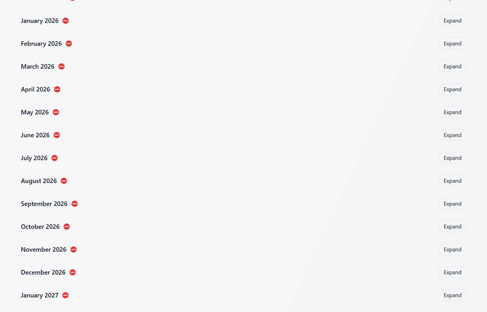

# OpenCashflow — Budget & Daily Balance Planner

Plan cash flow, simulate daily bank balances, visualize where every dollar goes, and explore credit-card impacts — all entirely local, no external connections.

Built nearly exclusively using OpenAI GPT‑5 AI working inside VS Code, guided by the original single‑file JSX prototype.

## Open source

This project is open‑source so others can contribute and benefit from capabilities missing in many commercial tools. PRs and issues are welcome.

## Original problem and objective

I wanted to know exactly where my money went and how much was needed on each day to cover liabilities — while uncovering areas to optimize. I also wanted to run simulations including tax refunds and one‑time bonuses to decide what liabilities to pay down to optimize monthly cash flow or reduce interest cost so I can stay in the black.

This app fulfills that through a daily simulation engine, multi‑month views, rich visualizations, and actionable warnings.

## Screenshots

- Dashboard Sankey (monthly flows with Bank vs Credit Cards)
  - 
- Daily Detail table with warnings and maturity highlights
  - 
- Liabilities and loan details modal
  - 
- Income with raises and one‑time incomes
  - 

## Key features

- Daily simulation engine
  - Per‑day accounting of incomes, planned outflows, credit‑card charges and payments, card interest, and running bank balance.
  - Intraday minimum balance tracking detects underfunded days even if end‑of‑day looks fine.
  - Multi‑month horizon with month‑to‑month carry of bank and card balances.
- Credit cards
  - Monthly interest accrual on due day (APR/12) before payment.
  - Minimum payment (percent vs floor) and optional over‑limit adhoc payments.
  - Configurable due day, APR, carry %, credit limit, over‑limit percentage.
- Liabilities and frequencies
  - Types: Utility, Subscription, Loan, Living Expense.
  - Frequencies: exact day, daily, every other day, weekly.
  - Loan details (origination, term, rate, original amount) with automatic maturity handling; expenses stop after maturity and the UI highlights maturity days.
- Incomes and modifiers
  - Recurring incomes by day.
  - Raises (effective date, percent) and one‑time incomes (e.g., tax refund, bonus).
- Deficit modeling
  - “Deficit from Savings” (covered by starting bank; gray) and “Unfunded Deficit” (not covered; deep red) shown as distinct sources feeding the bank in the Sankey.
  - Required starting bank computed; warnings/banners when funding is insufficient until next income day.
- Visualizations
  - Dashboard Sankey chart of monthly flows with two distinct funding sources: Bank and Credit Cards.
    - Colors: income (greens), expenses (cool blues/purples), credit flows (orange), savings deficit (gray), unfunded deficit (deep red).
    - Expand/collapse per category (and Expand all) to reveal item‑level flows.
  - Daily Detail table with warning banners, over‑limit and underfunded icons, and bank balance column.
- Data grids and editing
  - Table‑based editing for Liabilities, Incomes, and Credit Cards with sorting, tooltips, and modals (Manage Loan, confirm delete).
- Import/export and persistence
  - Local storage by default; optional linking to a local JSON file using the File System Access API (stays local to your machine).
  - Autosave to the linked file and manual import/export.
- Testing and quality
  - Vitest + Testing Library suite covering the simulation engine, helpers, grids, dashboard UI/Sankey, with coverage thresholds enforced.

## Coming soon (roadmap)

- Optimization simulations:
  - Recommend best liabilities to pay down given interest, dollar‑to‑balance ratios, and timing to optimize monthly cash flow and interest savings.
  - “What‑if” scenarios for tax refunds and one‑time bonuses.
- Automated insights on the Dashboard:
  - Flag when influx is needed, highlight right‑sizing opportunities, and surface the highest‑impact next actions.
- UX polish: dark mode, richer tooltips, performance tuning for large datasets.

## Privacy and data security

- The application runs entirely locally in your browser. There are no external servers, no trackers, and no network calls.
- Your data lives in localStorage and, if you choose, an optional local file via the File System Access API — still on your machine.

## Contributing

- Fork the repo, create a feature branch off main, and submit a PR.
- CI enforces: build, unit/UI tests, and coverage thresholds.
- On merges to main, screenshots are regenerated automatically and pushed.

Local dev:

```powershell
npm install
npm run dev
```

Run tests and coverage:

```powershell
npm test
npm run test -- --coverage
```

## License

Apache License 2.0 — see [LICENSE](LICENSE). Commercial and personal use permitted; includes explicit patent grant and contributor license grant.

## Tech stack

- React 18 + Vite 5
- Tailwind CSS 3
- Recharts 2
- Vitest + @testing‑library/react

## Getting started (local)

Prerequisites: Node.js 18+

1) Install dependencies

```powershell
npm install
```

1) Start the dev server

```powershell
npm run dev
```

Open the URL printed in the terminal (usually <http://localhost:5173>).

## Production build

```powershell
npm run build
npm run preview
```

## Project structure (high‑level)

- `src/BudgetApp.jsx` — app shell, state, import/export, horizon simulation wiring
- `src/lib/` — simulation engine and helpers (dates, cards, constants, fileAccess, formatters)
- `src/pages/` — Dashboard, Liabilities, Income, CreditCards, Setup
- `src/components/` — layout (Section, Modal), inputs, table
- `src/__tests__/` — unit/UI tests and Sankey tests

## Capture screenshots (optional)

Generate screenshots with Puppeteer (saves into `docs/images/`):

```powershell
npm run snap
```

This builds the app, launches a local preview, and grabs a few key shots (Sankey, detail).
